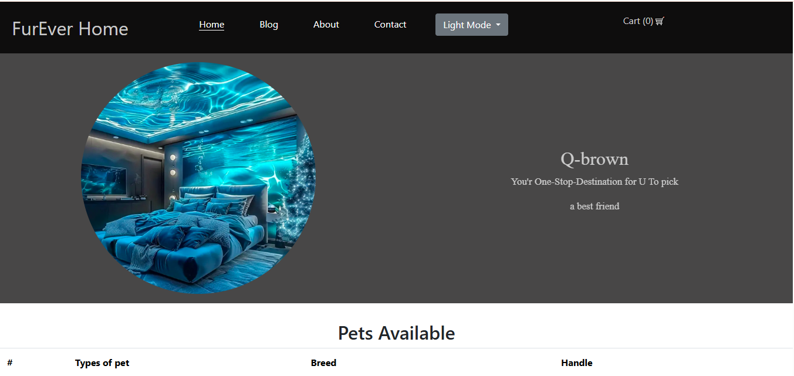
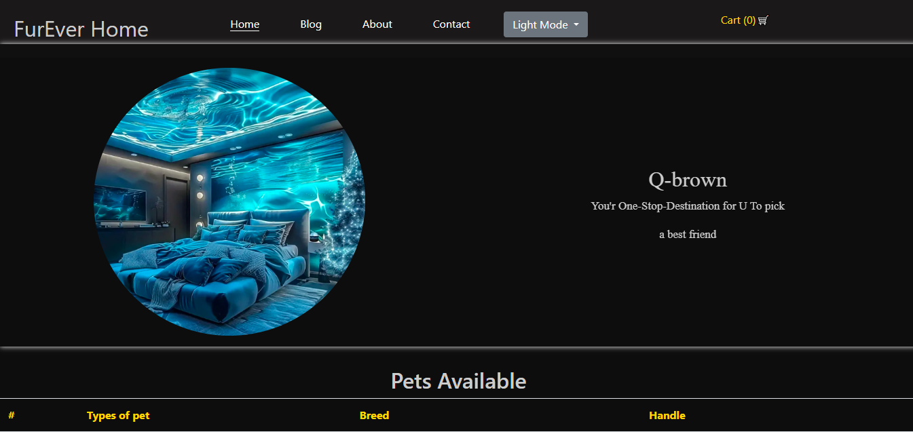

## Created by Anyikwa bruno
# 🐾 Paws Haven - Animal Shelter Website

A heartwarming project built to showcase adoptable pets, raise awareness, and help users connect with an animal shelter.

## ✨ Features
- Landing page with hero carousel
- Gallery of pets with adoption details
- Contact form for adoption requests
- Animated navigation menu
- Clean, user-friendly design

## 🛠️ Built With
- HTML5
- CSS3
- JavaScript

## 📌 Future Plans
- Add adoption form with Firebase storage
- User authentication for volunteers
- Donation integration
- Blog page to share pet stories

## 📷 Preview

## dark mode
